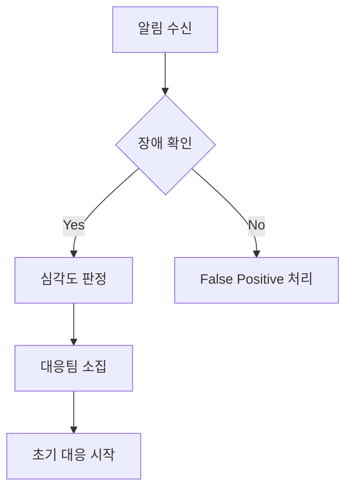

# Board-Lee 장애 대응 가이드 및 플레이북

## 목차
1. [장애 대응 개요](#장애-대응-개요)
2. [장애 분류 및 우선순위](#장애-분류-및-우선순위)
3. [장애 대응 프로세스](#장애-대응-프로세스)
4. [일반적인 장애 시나리오](#일반적인-장애-시나리오)
5. [단계별 대응 방법](#단계별-대응-방법)
6. [복구 및 사후 조치](#복구-및-사후-조치)
7. [연락처 및 에스컬레이션](#연락처-및-에스컬레이션)
8. [장애 대응 도구](#장애-대응-도구)

---

## 장애 대응 개요

### 목표
- **빠른 서비스 복구**: 사용자 영향 최소화
- **근본 원인 분석**: 재발 방지
- **지속적인 개선**: 시스템 안정성 향상

### 핵심 원칙
1. **사용자 우선**: 서비스 복구가 최우선
2. **명확한 소통**: 모든 이해관계자에게 상황 공유
3. **문서화**: 모든 조치 사항 기록
4. **사후 분석**: 개선점 도출 및 적용

---

## 장애 분류 및 우선순위

### 심각도 분류

#### 🔴 P1 - Critical (치명적)
**정의**: 서비스 완전 중단 또는 주요 기능 사용 불가
- 전체 시스템 다운
- 데이터베이스 완전 접근 불가
- 보안 침해 발생
- 데이터 손실

**목표 대응 시간**: 15분 이내 인지, 1시간 이내 복구

#### 🟡 P2 - High (높음)
**정의**: 일부 기능 장애 또는 성능 심각한 저하
- 특정 기능 사용 불가 (파일 업로드 등)
- API 응답 시간 > 10초
- 일부 사용자 접근 불가
- 메모리/CPU 사용률 > 95%

**목표 대응 시간**: 30분 이내 인지, 4시간 이내 복구

#### 🟢 P3 - Medium (보통)
**정의**: 사소한 기능 이상 또는 성능 저하
- UI 표시 오류
- API 응답 시간 5-10초
- 로그에 간헐적 오류 발생

**목표 대응 시간**: 2시간 이내 인지, 24시간 이내 복구

#### ⚫ P4 - Low (낮음)
**정의**: 사용자 경험에 미미한 영향
- 문서 오타
- 비필수 기능 개선 사항

**목표 대응 시간**: 업무일 기준 대응

---

## 장애 대응 프로세스

### 1단계: 장애 감지 및 인지 (Detection)


#### 장애 감지 경로
- **자동 모니터링**: Prometheus 알림, Kubernetes 이벤트
- **사용자 신고**: 고객지원팀 또는 직접 신고
- **수동 확인**: 정기 점검 중 발견

#### 초기 확인 절차
```bash
# 1. 서비스 상태 확인
curl -I http://20.249.113.18:9000/board/

# 2. Pod 상태 확인
kubectl get pods -n lee

# 3. 최근 이벤트 확인
kubectl get events -n lee --sort-by='.lastTimestamp' | head -10

# 4. 로그 확인
kubectl logs -f deployment/board-backend-deployment-lee -n lee --tail=100
```

### 2단계: 영향 범위 평가 (Assessment)
```bash
# 영향받는 사용자 수 추정
kubectl top pods -n lee

# 장애 지속 시간 확인
kubectl describe pod <failing-pod-name> -n lee

# 관련 서비스 상태 확인
kubectl get services -n lee
```

### 3단계: 즉시 조치 (Immediate Response)
```bash
# 긴급 복구 조치
kubectl rollout restart deployment/board-backend-deployment-lee -n lee

# 트래픽 우회 (필요시)
kubectl scale deployment board-backend-deployment-lee --replicas=0 -n lee

# 백업으로 롤백
kubectl rollout undo deployment/board-backend-deployment-lee -n lee
```

### 4단계: 근본 원인 분석 (Root Cause Analysis)
```bash
# 상세 로그 수집
kubectl logs deployment/board-backend-deployment-lee -n lee --previous > incident-logs.txt

# 시스템 메트릭 수집
kubectl top nodes
kubectl describe node <node-name>

# 네트워크 연결 확인
kubectl exec -it deployment/board-backend-deployment-lee -n lee -- netstat -tlnp
```

### 5단계: 복구 및 검증 (Recovery & Validation)
```bash
# 복구 확인
curl -s http://20.249.113.18:9000/board/api/actuator/health | jq .

# 기능 테스트
curl -X GET http://20.249.113.18:9000/board/api/posts

# 성능 검증
ab -n 100 -c 10 http://20.249.113.18:9000/board/api/posts
```

---

## 일반적인 장애 시나리오

### 시나리오 1: Pod 재시작 반복 🔄

#### 증상
- Pod가 계속 CrashLoopBackOff 상태
- 서비스 간헐적 접근 불가

#### 진단 절차
```bash
# 1. Pod 상태 확인
kubectl get pods -n lee -l app=board-backend-lee

# 2. Pod 로그 확인
kubectl logs <pod-name> -n lee --previous

# 3. Pod 상세 정보 확인
kubectl describe pod <pod-name> -n lee

# 4. 이벤트 확인
kubectl get events --field-selector involvedObject.name=<pod-name> -n lee
```

#### 대응 방법
```bash
# 즉시 조치: 이미지 롤백
kubectl rollout undo deployment/board-backend-deployment-lee -n lee

# 리소스 확인 및 조정
kubectl patch deployment board-backend-deployment-lee -n lee -p '{"spec":{"template":{"spec":{"containers":[{"name":"board-backend-container","resources":{"limits":{"memory":"1Gi","cpu":"1000m"}}}]}}}}'

# 설정 검증
kubectl get configmap board-config -n lee -o yaml
```

### 시나리오 2: 데이터베이스 연결 실패 🗄️

#### 증상
- API 요청 시 500 에러 발생
- "Connection refused" 로그 다수 발생

#### 진단 절차
```bash
# 1. 데이터베이스 연결 테스트
kubectl exec -it deployment/board-backend-deployment-lee -n lee -- \
  curl -s http://localhost:8082/actuator/health/db

# 2. 네트워크 연결 확인
kubectl exec -it deployment/board-backend-deployment-lee -n lee -- \
  telnet <db-host> 3306

# 3. 환경 변수 확인
kubectl exec deployment/board-backend-deployment-lee -n lee -- env | grep DB_
```

#### 대응 방법
```bash
# 연결 풀 재설정
kubectl rollout restart deployment/board-backend-deployment-lee -n lee

# 데이터베이스 상태 확인
# Azure MySQL의 경우 포털에서 확인

# 연결 정보 수정 (필요시)
kubectl patch secret board-secrets -n lee -p '{"data":{"DB_PASSWORD":"<new-base64-encoded-password>"}}'
```

### 시나리오 3: 메모리 부족 (OOMKilled) 💾

#### 증상
- Pod가 OOMKilled 상태로 재시작
- 메모리 사용량 급격한 증가

#### 진단 절차
```bash
# 1. 메모리 사용량 확인
kubectl top pods -n lee

# 2. Pod 이벤트 확인
kubectl describe pod <pod-name> -n lee | grep -A 5 -B 5 "OOMKilled"

# 3. 메모리 설정 확인
kubectl get deployment board-backend-deployment-lee -n lee -o jsonpath='{.spec.template.spec.containers[0].resources}'
```

#### 대응 방법
```bash
# 즉시 조치: 메모리 제한 증가
kubectl patch deployment board-backend-deployment-lee -n lee -p '{
  "spec": {
    "template": {
      "spec": {
        "containers": [{
          "name": "board-backend-container",
          "resources": {
            "limits": {"memory": "1Gi"},
            "requests": {"memory": "512Mi"}
          }
        }]
      }
    }
  }
}'

# JVM 힙 메모리 설정 조정
kubectl patch deployment board-backend-deployment-lee -n lee -p '{
  "spec": {
    "template": {
      "spec": {
        "containers": [{
          "name": "board-backend-container",
          "env": [{"name": "JAVA_OPTS", "value": "-Xmx768m -Xms256m"}]
        }]
      }
    }
  }
}'
```

### 시나리오 4: 파일 업로드 실패 📁

#### 증상
- 파일 업로드 시 오류 발생
- "No space left on device" 오류

#### 진단 절차
```bash
# 1. 디스크 사용량 확인
kubectl exec -it deployment/board-backend-deployment-lee -n lee -- df -h

# 2. 업로드 디렉토리 확인
kubectl exec -it deployment/board-backend-deployment-lee -n lee -- ls -la /app/uploads

# 3. PVC 상태 확인
kubectl get pvc -n lee
kubectl describe pvc board-files-pvc -n lee
```

#### 대응 방법
```bash
# 즉시 조치: 임시 파일 정리
kubectl exec -it deployment/board-backend-deployment-lee -n lee -- \
  find /app/uploads -type f -mtime +30 -delete

# PVC 용량 증대
kubectl patch pvc board-files-pvc -n lee -p '{"spec":{"resources":{"requests":{"storage":"20Gi"}}}}'

# 새로운 PVC로 마이그레이션 (필요시)
kubectl create -f - <<EOF
apiVersion: v1
kind: PersistentVolumeClaim
metadata:
  name: board-files-pvc-new
  namespace: lee
spec:
  accessModes:
    - ReadWriteOnce
  resources:
    requests:
      storage: 50Gi
  storageClassName: managed-csi
EOF
```

### 시나리오 5: 네트워크 연결 문제 🌐

#### 증상
- 서비스 간 통신 실패
- Gateway에서 503 오류 발생

#### 진단 절차
```bash
# 1. 서비스 엔드포인트 확인
kubectl get endpoints -n lee

# 2. 네트워크 정책 확인
kubectl get networkpolicies -n lee

# 3. DNS 해상도 테스트
kubectl exec -it deployment/board-backend-deployment-lee -n lee -- \
  nslookup board-frontend-service-lee.lee.svc.cluster.local

# 4. 포트 연결 테스트
kubectl exec -it deployment/board-backend-deployment-lee -n lee -- \
  telnet board-frontend-service-lee 80
```

#### 대응 방법
```bash
# 서비스 재시작
kubectl delete pod -l app=board-backend-lee -n lee

# DNS 캐시 초기화
kubectl rollout restart deployment/coredns -n kube-system

# 서비스 재생성 (필요시)
kubectl delete service board-backend-service-lee -n lee
kubectl apply -f backend/k8s/board-backend-service.yaml
```

---

## 단계별 대응 방법

### 🚨 P1 (Critical) 장애 대응

#### 즉시 실행 (0-15분)
```bash
# 1. 장애 확인 및 팀 소집
send_slack_alert "CRITICAL: Board-Lee service is down" "critical"

# 2. 긴급 우회 조치
# - 로드밸런서 헬스체크 실패 처리
# - 점검 페이지 활성화 (필요시)

# 3. 빠른 롤백
kubectl rollout undo deployment/board-backend-deployment-lee -n lee
kubectl rollout undo deployment/board-frontend-deployment-lee -n lee
```

#### 단기 대응 (15분-1시간)
```bash
# 1. 근본 원인 파악
kubectl logs deployment/board-backend-deployment-lee -n lee --previous > critical-incident.log

# 2. 데이터 무결성 확인
kubectl exec -it deployment/board-backend-deployment-lee -n lee -- \
  curl -s http://localhost:8082/actuator/health/db

# 3. 임시 수정 배포
docker build -t board-backend-hotfix .
docker tag board-backend-hotfix kt16big.azurecr.io/board-backend-lee:hotfix
docker push kt16big.azurecr.io/board-backend-lee:hotfix
kubectl set image deployment/board-backend-deployment-lee \
  board-backend-container=kt16big.azurecr.io/board-backend-lee:hotfix -n lee
```

### 🟡 P2 (High) 장애 대응

#### 초기 대응 (0-30분)
```bash
# 1. 영향 범위 확인
kubectl get pods -n lee -o wide

# 2. 모니터링 강화
kubectl logs -f deployment/board-backend-deployment-lee -n lee

# 3. 임시 조치
kubectl scale deployment board-backend-deployment-lee --replicas=3 -n lee
```

#### 본격 대응 (30분-4시간)
```bash
# 1. 상세 분석
kubectl exec -it deployment/board-backend-deployment-lee -n lee -- \
  jstack 1 > thread-dump.txt

# 2. 설정 최적화
kubectl patch deployment board-backend-deployment-lee -n lee -p '{
  "spec": {
    "template": {
      "spec": {
        "containers": [{
          "name": "board-backend-container",
          "env": [{"name": "SPRING_PROFILES_ACTIVE", "value": "production,optimized"}]
        }]
      }
    }
  }
}'
```

---

## 복구 및 사후 조치

### 복구 검증 체크리스트

#### ✅ 기능 검증
```bash
# API 상태 확인
curl -s http://20.249.113.18:9000/board/api/actuator/health

# 게시글 목록 조회
curl -s http://20.249.113.18:9000/board/api/posts | jq '.content | length'

# 파일 업로드 테스트
curl -X POST -F "title=테스트" -F "content=테스트 내용" \
  -F "files=@test.pdf" \
  http://20.249.113.18:9000/board/api/posts

# 데이터베이스 연결 확인
kubectl exec deployment/board-backend-deployment-lee -n lee -- \
  curl -s http://localhost:8082/actuator/health/db
```

#### ✅ 성능 검증
```bash
# 응답 시간 측정
curl -w "@curl-format.txt" -o /dev/null -s \
  http://20.249.113.18:9000/board/api/posts

# 부하 테스트
ab -n 100 -c 10 http://20.249.113.18:9000/board/api/posts

# 메모리 사용량 확인
kubectl top pods -n lee
```

### 사후 조치 절차

#### 1. 장애 보고서 작성
```markdown
# 장애 보고서 템플릿

## 장애 개요
- **발생 시간**: 2025-08-28 14:30:00 KST
- **복구 시간**: 2025-08-28 15:15:00 KST
- **영향 시간**: 45분
- **심각도**: P1 (Critical)

## 영향 범위
- **사용자**: 약 50명 (전체 사용자)
- **기능**: 전체 서비스 접근 불가
- **데이터**: 손실 없음

## 근본 원인
- 메모리 부족으로 인한 Pod OOMKilled
- JVM 힙 메모리 설정 부족

## 대응 조치
1. 즉시 조치: 이전 버전으로 롤백
2. 단기 조치: 메모리 제한 증대
3. 장기 조치: JVM 튜닝 및 모니터링 강화

## 개선 사항
- [ ] JVM 메모리 설정 최적화
- [ ] 메모리 사용량 알림 임계값 조정
- [ ] 부하 테스트 시나리오 추가
```

#### 2. Post-Mortem 회의
- **참석자**: 개발팀, 운영팀, 관리자
- **안건**: 
  - 장애 경과 검토
  - 대응 과정 평가
  - 개선 방안 도출
  - 예방 조치 수립

#### 3. 예방 조치 구현
```bash
# 모니터링 알림 임계값 조정
kubectl apply -f - <<EOF
apiVersion: monitoring.coreos.com/v1
kind: PrometheusRule
metadata:
  name: board-memory-alert
  namespace: lee
spec:
  groups:
  - name: board-memory
    rules:
    - alert: HighMemoryUsage
      expr: container_memory_usage_bytes / container_spec_memory_limit_bytes > 0.8
      for: 5m
      labels:
        severity: warning
      annotations:
        summary: "High memory usage detected"
EOF

# 리소스 제한 조정
kubectl patch deployment board-backend-deployment-lee -n lee -p '{
  "spec": {
    "template": {
      "spec": {
        "containers": [{
          "name": "board-backend-container",
          "resources": {
            "limits": {"memory": "1Gi", "cpu": "1000m"},
            "requests": {"memory": "512Mi", "cpu": "500m"}
          }
        }]
      }
    }
  }
}'
```

---

## 연락처 및 에스컬레이션

### 대응팀 연락처

#### 1차 대응팀 (24/7)
```
팀장: 김개발 (010-1234-5678)
- Slack: @kim.dev
- Email: kim.dev@company.com
- 역할: 초기 대응 및 조치

백엔드 개발자: 박백엔드 (010-2345-6789)  
- Slack: @park.backend
- Email: park.backend@company.com
- 역할: 백엔드 이슈 대응

프론트엔드 개발자: 이프론트 (010-3456-7890)
- Slack: @lee.frontend  
- Email: lee.frontend@company.com
- 역할: 프론트엔드 이슈 대응
```

#### 2차 지원팀
```
인프라 엔지니어: 최인프라 (010-4567-8901)
- 역할: Kubernetes, 네트워크 이슈

데이터베이스 관리자: 정디비 (010-5678-9012)
- 역할: 데이터베이스 관련 이슈

보안 담당자: 한보안 (010-6789-0123)
- 역할: 보안 이슈 대응
```

### 에스컬레이션 기준

#### P1 장애 에스컬레이션
```
즉시 (0분): 1차 대응팀 소집
15분: 2차 지원팀 대기
30분: 경영진 보고
1시간: 고객사 공지 검토
```

#### P2 장애 에스컬레이션  
```
30분: 1차 대응팀
2시간: 2차 지원팀 지원
4시간: 경영진 보고
```

### 커뮤니케이션 채널

#### Slack 채널
- `#board-lee-alerts`: 자동 알림
- `#board-lee-incidents`: 장애 대응 논의
- `#board-lee-general`: 일반 소통

#### 상황 보고 템플릿
```
🔴 [P1 장애] Board-Lee 서비스 중단

발생시간: 2025-08-28 14:30
현재상황: 전체 서비스 접근 불가
원인: 조사 중
예상복구: 1시간 이내
담당자: @kim.dev

업데이트는 이 스레드에서 계속됩니다.
```

---

## 장애 대응 도구

### 필수 도구 목록

#### 명령어 도구
```bash
# kubectl 설정 확인
kubectl config current-context

# 자주 사용하는 alias 설정
alias k='kubectl'
alias kgp='kubectl get pods'
alias kgs='kubectl get services'
alias kge='kubectl get events --sort-by=.metadata.creationTimestamp'
alias klog='kubectl logs -f'
```

#### 모니터링 도구
```bash
# 시스템 상태 한눈에 보기
watch -n 1 'kubectl get pods -n lee'

# 리소스 사용량 실시간 모니터링  
watch -n 5 'kubectl top pods -n lee'

# 로그 실시간 추적
kubectl logs -f deployment/board-backend-deployment-lee -n lee | grep ERROR
```

#### 긴급 스크립트
```bash
#!/bin/bash
# emergency-restart.sh
echo "Emergency restart initiated at $(date)"
kubectl rollout restart deployment/board-backend-deployment-lee -n lee
kubectl rollout restart deployment/board-frontend-deployment-lee -n lee
kubectl rollout status deployment/board-backend-deployment-lee -n lee
kubectl rollout status deployment/board-frontend-deployment-lee -n lee
echo "Emergency restart completed at $(date)"
```

### 장애 대응 체크리스트

#### ⚡ 즉시 실행 (첫 15분)
- [ ] 장애 확인 및 심각도 판정
- [ ] 대응팀 소집 (Slack 알림)
- [ ] 서비스 상태 확인
- [ ] 긴급 복구 조치 실행
- [ ] 이해관계자 알림

#### 🔍 상세 분석 (15분-1시간)  
- [ ] 로그 수집 및 분석
- [ ] 근본 원인 파악
- [ ] 영향 범위 정확한 평가
- [ ] 복구 계획 수립
- [ ] 진행 상황 주기적 공유

#### 📋 복구 후 조치 (1시간 이후)
- [ ] 기능 및 성능 검증
- [ ] 사용자 영향 평가
- [ ] 장애 보고서 작성
- [ ] Post-Mortem 회의 일정
- [ ] 예방 조치 계획 수립

이 플레이북을 통해 Board-Lee 시스템의 장애 상황에 체계적이고 효과적으로 대응할 수 있습니다.