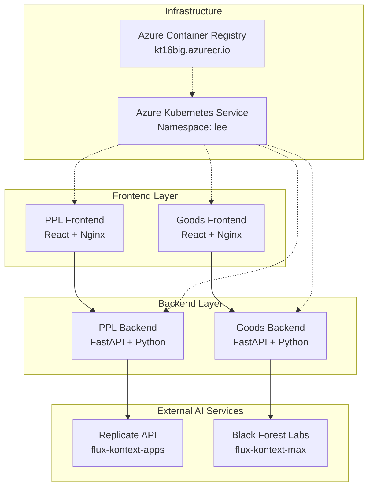

# 📚 PPL 이미지 생성 플랫폼 문서 센터

이 디렉토리에는 PPL 이미지 생성 서비스와 굿즈 이미지 생성 서비스의 운영 및 기술 문서가 포함되어 있습니다.

## 🗂️ 문서 구조

### 📋 [아키텍처 결정 기록 (ADR)](./architecture-decision-record.md)
> **Architecture Decision Records**

시스템 설계 시 내린 중요한 기술적 결정들과 그 배경을 기록한 문서입니다.

**주요 내용:**
- ADR-001: 마이크로서비스 아키텍처 채택
- ADR-002: AI 모델 서비스 분리 (Replicate API vs BFL API)
- ADR-003: 이미지 데이터 처리 방식 (Direct Binary Response)
- ADR-004: 컨테이너 오케스트레이션 플랫폼 (Azure Kubernetes Service)
- ADR-005: 프론트엔드 상태 관리 (React Built-in Hooks)

---

### 🔧 [트러블슈팅 가이드](./troubleshooting-guide.md)
> **Troubleshooting Guide & Incident Reports**

서비스 운영 중 발생할 수 있는 문제들과 해결 방법을 정리한 실무 가이드입니다.

**주요 내용:**
- **일반적인 문제들**
  - 이미지 생성 타임아웃
  - ImagePullBackOff 오류
  - API 키 관련 오류
- **서비스별 특화 문제**
  - PPL 생성기: 두 이미지 합성 실패, safety_tolerance 설정
  - 굿즈 생성기: BFL API 폴링 실패, 단일 이미지 처리 문제
- **인프라 관련 문제**
  - Pod OOMKilled, 서비스 간 통신 실패, 노드 리소스 부족
- **모니터링 및 로그 분석 방법**
- **장애 복구 절차 및 에스컬레이션**

---

### 📖 [운영 런북](./operations-runbook.md)
> **Operations Runbook & Standard Operating Procedures**

일상적인 서비스 운영을 위한 표준 작업 절차와 체크리스트입니다.

**주요 내용:**
- **일일 운영 절차**
  - 오전/저녁 체크리스트
  - 서비스 상태 점검 방법
- **배포 프로세스**
  - 표준 배포 절차 (4단계)
  - 이미지 빌드 및 푸시
  - 배포 검증 및 롤백
- **모니터링 및 알람**
  - 핵심 메트릭 정의
  - 성능 지표 및 임계값
- **백업 및 복구**
  - 설정 파일 백업
  - 완전 복구 절차
- **보안 관리**
  - API 키 정기 갱신
  - 네트워크 보안 검증
- **성능 관리**
  - 리소스 조정 및 HPA 설정
- **정기 유지보수**
  - 주간/월간 유지보수 작업

---

## 🎯 용도별 문서 가이드

### 👩‍💻 **개발팀**을 위한 문서
- [아키텍처 결정 기록](./architecture-decision-record.md) - 기술적 의사결정 배경 이해
- [트러블슈팅 가이드](./troubleshooting-guide.md) - 개발/테스트 시 문제 해결

### 👨‍🔧 **운영팀**을 위한 문서
- [운영 런북](./operations-runbook.md) - 일일 운영 작업 및 배포 절차
- [트러블슈팅 가이드](./troubleshooting-guide.md) - 운영 중 장애 대응

### 👔 **관리자**를 위한 문서
- [아키텍처 결정 기록](./architecture-decision-record.md) - 시스템 구조 및 결정 사항 파악
- [운영 런북](./operations-runbook.md) - 운영 프로세스 및 보안 관리

---

## 🏗️ 시스템 아키텍처 개요

---

## 📊 서비스 현황

| 서비스 | 상태 | 포트 | 배포명 | AI 모델 |
|--------|------|------|--------|---------|
| PPL Frontend | ✅ 운영중 | 80 | ppl-gen-frontend-deployment-lee-2 | - |
| PPL Backend | ✅ 운영중 | 8000 | ppl-gen-backend-deployment-lee-2 | Replicate API |
| Goods Frontend | ✅ 운영중 | 80 | goods-gen-frontend-deployment-lee-2 | - |
| Goods Backend | ✅ 운영중 | 8001 | goods-gen-backend-deployment-lee-2 | BFL API |

---

## 🔗 관련 링크

- [프로젝트 메인 README](../README.md)
- [Kubernetes 서비스 가이드](../kubernetes-service-guide.md)
- [배포 설정 파일](../all-deployment.yaml)

---

## 📝 문서 업데이트 정책

- **정기 검토**: 분기별 (3개월마다)
- **버전 관리**: Git을 통한 변경 이력 추적
- **승인 프로세스**: 변경 시 개발팀 리뷰 필수

---

## 💡 문서 개선 제안

문서에 대한 피드백이나 개선사항이 있으시면 다음을 통해 제안해 주세요:
- 이슈 생성을 통한 개선사항 제안
- Pull Request를 통한 직접적인 수정 제안

---

**최종 업데이트**: 2024-08-19  
**작성자**: Lee Development Team  
**버전**: 1.0